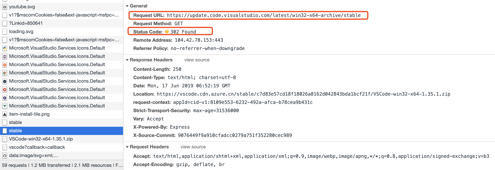
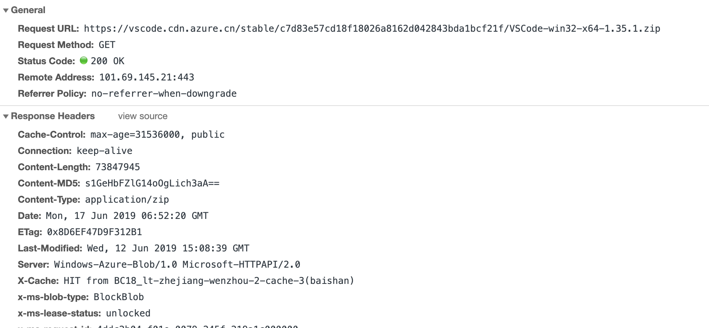

## 通过脚本的方式手动更新vscode
（如果一开始是以zip方式安装且为windows）

[github repository](https://github.com/kvsur/Independent_update_vscode)

vscode 在各大平台都有对应的不同的安装方式，windows 系统中有一个下载zip包安装的方式；


点击下载之后直接解压zip包到对应的目录即可使用，还是很快捷的；使用的过程会发现一个问题，就是更新的时候；
在GUI中点击更新，下载的更新和之前的安装方式一样，也是一个zip包；


这就导致又走了一遍安装的流程，如果vscode更新频繁的话，这就有点麻烦了；
然后就想，与其等它推送繁琐更新，还不如自己去拉包更新，然后做一点的小小的脚本自动化；


#### 0. 总体思路介绍

1. 拉取对应版本的zip文件
2. 解压zip，覆盖更新

#### 1. 怎么获取最新稳定版本呢？

如上版本信息展示图中，我们点击 .zip 64bit 想要下载zip包时，页面路由发生变化，新路由中页面请求了一个重的路径

```json
{
    'Request URL': 'https://update.code.visualstudio.com/latest/win32-x64-archive/stable',
    'Request Method': 'GET',
    'Status Code': '302 Found',
    'Remote Address': '104.42.78.153:443',
    'Referrer Policy': 'no-referrer-when-downgrade',
}
```


这是一个重定向的请求，接着重定向到了



所以通过这样的方式，最终能拿到code.zip文件的到本地，在node脚本中使用request处理这些请求，request能处理重定向，然后将返回的文件流保存到本地磁盘即可

```js
    const file = fs.createWriteStream(ARCHIVE_PATH);

    // fetch the lasest stable version of vscode
    request.get(STABLE_URI).on('error', e => {
        error(e.message);
        error(`Update vscode failed.`);
    }).pipe(file);
```

#### 2. 拿到包之后覆盖更新本地文件

这个地方的逻辑相对简单，使用几行shell命令来搞定

```bash
#!/bin/bash
echo ${1}
echo ${2}
echo ${3}

unzip ${1} -d ${2}/
rm -rf ${3}/*
mv ${2}/* ${3}/
rm -rf ${1} ${2}/*
exit
```

#### 3. 配置文件


```js
module.exports = {
    SHELL_PATH: '/d/vscode_update_program/update.sh', // 更新版本所需shell脚本的存放位置
    INSTALL_PATH: '/d/vscode',
    UNZIP_PATH: '/d/vscode_update_program/vscodePackage/package',
    ARCHIVE_PATH: '/d/vscode_update_program/vscodePackage/vscode.zip', // 新版本压缩包下载后存放路径
    STABLE_URI: 'https://update.code.visualstudio.com/latest/win32-x64-archive/stable', // 最新稳定版包的获取地址
    MESSAGE: {
        success: 'green',
        error: 'red',
        warning: 'yellow',
    },
}
```