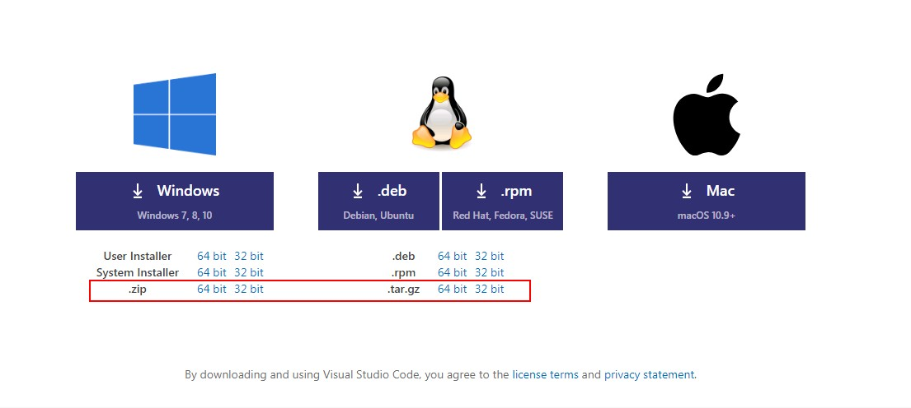
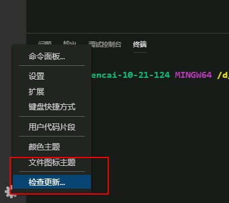
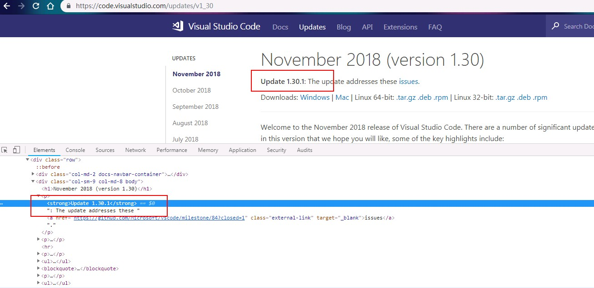
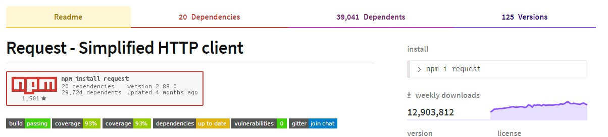

### 手动更新vscode，拉去官方zip包覆盖式更新

[github repository](https://github.com/kvsur/hanle_vscode_update)

vscode 在各大平台都有对应的不同的安装方式，windows 系统中有一个下载zip包安装的方式；



点击下载之后直接解压zip包到对应的目录即可使用，还是很快捷的；使用的过程会发现一个问题，就是更新的时候；
在GUI中点击更新，下载的更新和之前的安装方式一样，也是一个zip包；



这就导致又走了一遍安装的流程，如果vscode更新频繁的话，这就有点麻烦了；
然后就想，与其等它推送繁琐更新，还不如自己去拉包更新，然后做一点的小小的脚本自动化；


### 总体思路介绍

1. 获取最新版本
2. 拉取对应版本的zip文件
3. 解压zip，覆盖更新

#### 1. 怎么获取最新版本号呢？

要更新到最新版，首要的是知道最新的版本号；这个是重点，网上看了下，有没有官方提供的接口获取最新版本号之类的，
并没有找到；那就自己找吧，把vscode官方页面翻了一下，发现了这个奇特的号码；而且提供的是完整的版本号；



好的，既然知道哪儿有版本号，那拿到它就相对简单了；



借用request请求[https://code.visualstudio.com/updates/v1_30](https://code.visualstudio.com/updates/v1_30)以获取页面内容
进而使用正则匹配到version就好了；

* config
```js
module.exports = {
    ZIP_URI: ['https://vscode.cdn.azure.cn/stable/dea8705087adb1b5e5ae1d9123278e178656186a/VSCode-win32-x64-', '.zip'],
    VERSION_URI: 'https://code.visualstudio.com/updates/v1_30',
    SHELL_PATH: 'd:/vscode_update_program/update.sh',
    ARCHIVE_PATH: 'd:/vscode_update_program/vscodePackage/vscode.zip',
    MESSAGE: {
        success: 'green', // 成功输出内容
        error: 'red', // 错误输出内容
        warning: 'yellow', // 警告输出内容 
    },
}
```

#### 2. 拉取zip包

vscode的zip下载地址是固定模式的，变化的是版本号，所以将获取的版本join到zip请求地址中即可，再使用request拉取zip文件流保存到本地；
zip包获取接口返回的是文件流，需要借助fs文件模块；

```js
// 首先获取最新的版本号
request.get(VERSION_URI, (err, response, body) => {
    const html = body.toString();

    // 通过 strong 标签 加上 Update 关键字匹配到信息 节点
    const infoReg = (/<strong>Update[^(</strong>)]+<\/strong>/g);

    // 再一次精准匹配版本号 version
    const versionReg = (/\d.+</g);

    const version = html.match(infoReg)[0].match(versionReg)[0].replace('<', '');

    // 将版本号插入到拉取zip文件的URI中取
    const vscode_udpate_url = ZIP_URI.join(version);

    // 创建即将拉取的zip文件的文件流
    const file = fs.createWriteStream(ARCHIVE_PATH);

    // 拉取版本号对应的zip文件
    request.get(vscode_udpate_url).on('error', e => {
        error(e.message);
        error(`vscode更新失败，版本号：${version}`);
    }).pipe(file);
});
```

#### 3. 解压zip包，覆盖式更新vscode

好的，既然拿到了更新包文件，那就开始更新吧；
1. 解压
2. 删除旧版本
3. 移动解压文件到安装目录
4. 删除下载的zip文件

这些使用node都可以完成，不过写了之后感觉代码量多了，写了两行shell代替执行；
执行shell脚本的话用node的child_proces模块中的exec就好了；

* shell脚本， (相对简单，没做异常处理)

```shell
#!/bin/bash

unzip /d/vscode_update_program/vscodePackage/vscode.zip -d /d/vscode_update_program/vscodePackage/package/
rm -rf /d/vscode/*
mv /d/vscode_update_program/vscodePackage/package/* /d/vscode/
rm -rf /d/vscode_update_program/vscodePackage/vscode.zip

exit
```

```js
file.on('finish', () => {
    exec(SHELL_PATH, (err, stdout, stderr) => {
        if (err) {
            error(err);
            error(`vscode更新失败，版本号：${version}`);
        }
        if (stderr) {
            warning(stderr);
        } else {
            success(`vscode更新成功，版本号：${version}`);
        }
    });
});
```

#### 4. 完整代码

另外用了一个小小彩色输出库chalk用来打印日志；

```js
const chalk = require('chalk');
const chalkConfig = require('./config').MESSAGE;

Object.keys(chalkConfig).forEach(key => {
    module.exports[key] = content => {
        console.log(chalk[chalkConfig[key]](content));
    }
});
```

以下是更新部分的完整代码：

```js
const request = require('request');
const fs = require('fs');
const exec = require('child_process').exec;
const { success, error, warning } = require('./message');
const { ZIP_URI, VERSION_URI, ARCHIVE_PATH, SHELL_PATH } = require('./config');

module.exports = () => {
    // 首先获取最新的版本号
    request.get(VERSION_URI, (err, response, body) => {
        const html = body.toString();

        // 通过 strong 标签 加上 Update 关键字匹配到信息 节点
        const infoReg = (/<strong>Update[^(</strong>)]+<\/strong>/g);

        // 再一次精准匹配版本号 version
        const versionReg = (/\d.+</g);

        const version = html.match(infoReg)[0].match(versionReg)[0].replace('<', '');

        // 将版本号插入到拉取zip文件的URI中取
        const vscode_udpate_url = ZIP_URI.join(version);

        // 创建即将拉取的zip文件的文件流
        const file = fs.createWriteStream(ARCHIVE_PATH);

        // 拉取版本号对应的zip文件
        request.get(vscode_udpate_url).on('error', e => {
            error(e.message);
            error(`vscode更新失败，版本号：${version}`);
        }).pipe(file);

        file.on('finish', () => {
            exec(SHELL_PATH, (err, stdout, stderr) => {
                if (err) {
                    error(err);
                    error(`vscode更新失败，版本号：${version}`);
                }
                if (stderr) {
                    warning(stderr);
                } else {
                    success(`vscode更新成功，版本号：${version}`);
                }
            });
        });
    });
}
```

#### 最后
不是说不会安装vscode其他方式，只是刚好想尝试一下这样的更新方式；当然，肯定推荐直接安装exe、rpm之类的；
